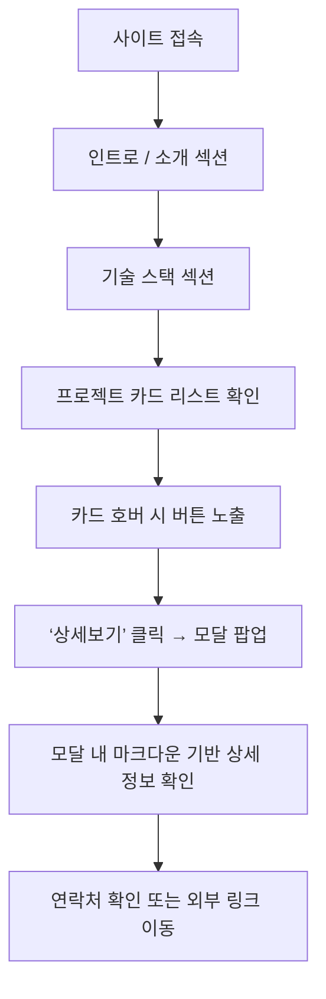

# 📝 제품 요구사항 문서 (PRD)

## 1. 프로젝트 개요

-   **제품명:** JaeUk Portfolio
-   **목표:** 프론트엔드 개발자로서의 기술 역량과 프로젝트 경험을 간결하게 전달하는 개인 포트폴리오 사이트
-   **주요 특징:**
    -   아이콘 기반 기술 스택 소개
    -   프로젝트 정보는 카드 형태 + 모달을 통해 제공
    -   반응형, 심플한 UI 구성
-   **타겟 사용자:** 개발자 채용 담당자, 협업 희망자, 지인 등

---

## 2. 유저 플로우



-   사용자가 사이트 접속
-   소개 섹션 → 기술 스택 섹션 → 프로젝트 리스트 순으로 스크롤
-   프로젝트 리스트는 카드 형태로, 화면 크기에 따라 한 줄당 카드 개수 유동적
-   각 카드에 마우스 호버 시 “상세보기” 및 (선택적) “GitHub 바로가기” 버튼 노출
-   “상세보기” 클릭 시 모달 팝업에서 마크다운 상세 정보 확인
-   모달 내 GitHub 링크 또는 외부 링크로 이동 가능
-   화면 하단에서 연락처 및 소셜 링크 확인

---

## 3. 기술 스택

| 범주        | 기술                      |
| ----------- | ------------------------- |
| 프레임워크  | Next.js (App Router 기반) |
| UI 컴포넌트 | ShadCN UI                 |
| 스타일링    | Tailwind CSS              |
| 애니메이션  | Framer Motion             |
| 백엔드/DB   | Supabase                  |
| 빌드/배포   | Vercel                    |

> ⚠️ 추가 기술 스택이 필요 시 이 항목에 업데이트

---

## 4. 주요 기능 정의

### 4.1 소개 섹션

-   **목적 / 가치:** 방문자에게 간단한 프로필, 연락처, 소셜 링크 제공
-   **구성 요소:**
    -   이름, 직함, 한 줄 소개 문구
    -   이메일, GitHub, 블로그 등 외부 링크 아이콘

---

### 4.1A 인터뷰 Q&A 카드 섹션

-   **목적 / 가치:** 지원자의 개발 철학, 문제 해결 접근 방식, 사용자 중심 사고를 강조
-   **모듈 경로:**  
    \`components/InterviewCard.tsx\`
-   **구성 요소:**
    -   질문 텍스트 (예: "Q. 프론트엔드로 전향한 이유?")
    -   답변 본문 (줄바꿈 포함된 텍스트)
    -   강조 텍스트를 \`<strong>\` 또는 Tailwind 클래스(`font-bold text-accent`)로 강조
-   **스타일:**
    -   Tailwind + ShadCN 조합
    -   반응형 정렬
-   **이벤트 트리거:** 없음 (정적 정보)

---

### 4.2 기술 스택 섹션

-   **목적 / 가치:** 보유 기술을 시각적 아이콘으로 한눈에 전달
-   **구성 요소:**
    -   주요 기술 아이콘 (Next.js, ShadCN, TailwindCSS 등)
    -   아이콘 툴팁(영문 기술명, 선택사항)
    -   Tailwind 기반 반응형 그리드 레이아웃

---

### 4.3 프로젝트 카드 리스트

-   **목적 / 가치:** 프로젝트 요약 정보를 카드 형태로 표시, 상세 정보 접근 유도
-   **모듈 경로:**  
    \`components/ProjectCard.tsx\`, \`components/ProjectList.tsx\`, \`pages/index.tsx\`
-   **Primary Actor:** 웹사이트 방문자

-   **구성 요소:**

    -   썸네일 이미지
    -   프로젝트 제목
    -   간단한 소개 (1~2줄)

-   **반응형 레이아웃 예시:**

    -   모바일: 1열
    -   태블릿: 2열
    -   데스크탑: 3~4열

-   **호버 시 오버레이 버튼:**

    -   상세보기 (필수)
    -   GitHub 바로가기 (선택적, \`repoUrl\` 없으면 숨김)

-   **버튼 디자인:**

    -   ShadCN UI의 Button 컴포넌트
    -   반투명 배경, 아이콘 포함

-   **이벤트 트리거:**
    -   마우스 hover → 버튼 노출
    -   “상세보기” 클릭 → 모달 팝업
    -   “GitHub 바로가기” 클릭 → 새 탭 링크

---

### 4.4 프로젝트 상세 모달

-   **목적 / 가치:** 페이지 전환 없이 프로젝트 상세 내용을 시각적으로 풍부하게 제공하며, 관련 문서/포스트를 바로 참조할 수 있는 기능 제공
-   **모듈 경로:**  
    `components/ProjectModal.tsx`,  
    `components/MarkdownRenderer.tsx`,  
    `components/ProjectCover.tsx`,  
    `components/ImageGallery.tsx`,  
    `components/RelatedDrawer.tsx`

-   **Primary Actor:** 웹사이트 방문자

---

#### 📥 입력값

-   `projectId`: 프로젝트 고유 ID
-   `markdownContent`: 마크다운 형식의 설명 문자열
-   `coverImageUrl`: 커버 이미지 URL
-   `coverColor`: 배경 색상 코드 (예: `#ff1e1e`)
-   `galleryImages`: 작업 화면 이미지 배열 (썸네일 + 원본 URL)
-   `relatedLinks`: 블로그 글 또는 기술 문서 링크 배열
    ```ts
    type RelatedLink = {
        title: string;
        url: string;
    };
    ```

---

#### 🧩 구성 요소

1. **상단 커버**

    - 배경 색상 + 커버 이미지
    - 프로젝트 정보 (제목, 참여 방식, 기간 등)

2. **본문 마크다운 콘텐츠**

    - `react-markdown` + `remark-gfm`으로 마크다운 렌더링

3. **작업 이미지 갤러리**

    - 썸네일 나열 후 클릭 시 확대 보기 (Lightbox)

4. **관련 링크 드로어**

    - 화면 우측 상단 버튼 그룹 중에 “관련 링크” 버튼 고정
    - 클릭 시 사이드 드로어(`<Drawer>`) 오픈
    - 리스트 형식으로 외부 링크 및 제목 노출
    - 각 항목 클릭 시 새 탭으로 이동
    - 드로어 닫기 기능 포함
    - 예시 제목: "다크모드 구현하기", "URLSearchParams 활용하기" 등

5. **기타 버튼**
    - GitHub / 데모 버튼 (조건부 렌더링)
    - 모달 닫기 버튼

---

#### ⚙️ 처리 로직

1. 프로젝트 상세 버튼 클릭 → 모달 오픈
2. 프로젝트 ID 기반 데이터 fetch
3. 마크다운 본문 및 커버 렌더링
4. `relatedLinks`가 존재할 경우 → 관련 블로그 버튼 표시
5. 클릭 시 `<Drawer>` 컴포넌트 열기
6. 리스트 항목 클릭 시 `target="_blank"`로 외부 이동
7. 갤러리 및 GitHub 버튼 기능 포함

---

#### 📱 반응형 고려사항

-   드로어는 모바일에서 전체 화면 슬라이드로 전환
-   이미지 썸네일은 그리드 형태로 줄 바꿈
-   GitHub 버튼/블로그 버튼은 하단 고정 또는 FAB 스타일

---

### 4.5 교육 이수 내역 카드

-   **목적 / 가치:** 수강 완료한 교육 및 부트캠프 이력 등을 시각적으로 명확하게 전달
-   **모듈 경로:**  
    `components/EducationCard.tsx`, `components/EducationList.tsx`, `pages/index.tsx`
-   **Primary Actor:** 웹사이트 방문자

-   **구성 요소:**

    -   교육명 (예: 멋사 프론트엔드 스쿨 5기)
    -   교육 기관명 (예: 멋쟁이사자처럼, 코드스테이츠 등)
    -   이수 기간 (예: 2023.01 ~ 2023.06)
    -   간단한 설명 또는 키워드 태그 (선택사항)

-   **디자인/레이아웃:**

    -   카드 형태로 구성
    -   Tailwind 기반 반응형 레이아웃 (프로젝트 카드 스타일과 유사)
    -   아이콘 또는 배지 스타일로 시각적 강조

-   **이벤트 트리거:**

    -   해당 없음 (정적 정보)

-   **출력값:**
    -   교육 이수 내역 리스트가 카드 형태로 출력됨
    -   추후 확장 시: 상세보기 또는 인증서 링크 추가 가능

---

### 4.6 마무리 / Footer 섹션

-   **목적 / 가치:** 포트폴리오의 종료 지점을 부드럽게 전달하고, 외부 채널(GitHub, Velog 등)로 자연스럽게 유도
-   **모듈 경로:**  
    `components/sections/FooterSection.tsx`
-   **Primary Actor:** 웹사이트 방문자

-   **구성 요소:**

    -   대형 Thank You 텍스트 (영문)
    -   한글 메시지: “봐주셔서 감사합니다 :)”
    -   간단한 자기소개/개발 철학 문장
        -   예: “프론트엔드 개발자로 성장하기 위해 낮선 기술에도 적극적으로 도전하고...”
    -   외부 링크 버튼 2개
        -   GitHub
        -   Velog
    -   하단 저작권 텍스트
        -   예: “Copyright 2023. chojieun all rights reserved.”
    -   기술 기반 설명 (React, Styled Components, Tailwind CSS)

-   **스타일링:**

    -   배경: 연한 마블 질감 이미지 또는 배경색 (`bg-[url('/marble.jpg')]`)
    -   중앙 정렬, 대형 텍스트 대비 강조
    -   버튼은 하단 라인 강조 (`border-b`) 스타일
    -   Tailwind 기준 `text-center`, `font-light`, `tracking-wide` 등 활용

-   **이벤트 트리거:**

    -   GitHub / Velog 버튼 클릭 → 새 탭 링크 이동
    -   오른쪽 하단 floating 버튼 (메일, 블로그, 스크롤 업)

-   **반응형 대응:**
    -   모바일/태블릿 환경에서도 폰트 크기 및 버튼 정렬 최적화

---

## 5. 기능 개발 이후 추가 개선 사항

| 항목                      | 설명                                           |
| ------------------------- | ---------------------------------------------- |
| 시작 화면 애니메이션      | Framer Motion으로 인트로 애니메이션 구성       |
| 프로젝트 필터 / 정렬 기능 | 기술 스택별 필터, 최신순/인기순 정렬 옵션      |
| MDX 기반 프로젝트 관리    | `.mdx` 파일 기반 프로젝트 관리로 유지보수 향상 |
| 다국어 지원               | `i18n` 도입으로 영어/한국어 전환 지원          |
| 이력서 다운로드 버튼      | PDF 이력서 다운로드 기능 추가                  |
| 추가 백엔드 기능          | Supabase Functions로 서버리스 API + 문의 폼    |
| SEO 최적화                | meta / OG 태그 및 \`schema.org\` 구조화 데이터 |
