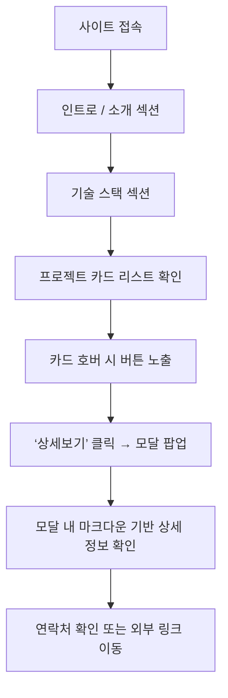

# 📝 제품 요구사항 문서 (PRD)

## 1. 프로젝트 개요

-   **제품명:** JaeUk Portfolio
-   **목표:** 프론트엔드 개발자로서의 기술 역량과 프로젝트 경험을 간결하게 전달하는 개인 포트폴리오 사이트
-   **주요 특징:**
    -   아이콘 기반 기술 스택 소개
    -   프로젝트 정보는 카드 형태 + 모달을 통해 제공
    -   반응형, 심플한 UI 구성
-   **타겟 사용자:** 개발자 채용 담당자, 협업 희망자, 지인 등

---

## 2. 유저 플로우

-   사용자가 사이트 접속
-   소개 섹션 → 기술 스택 섹션 → 프로젝트 리스트 순으로 스크롤
-   프로젝트 리스트는 카드 형태로, 화면 크기에 따라 한 줄당 카드 개수 유동적
-   각 카드에 마우스 호버 시 “상세보기” 및 (선택적) “GitHub 바로가기” 버튼 노출
-   “상세보기” 클릭 시 모달 팝업에서 마크다운 상세 정보 확인
-   모달 내 GitHub 링크 또는 외부 링크로 이동 가능
-   화면 하단에서 연락처 및 소셜 링크 확인

---

## 3. 기술 스택

| 범주        | 기술                      |
| ----------- | ------------------------- |
| 프레임워크  | Next.js (App Router 기반) |
| UI 컴포넌트 | ShadCN UI                 |
| 스타일링    | Tailwind CSS              |
| 애니메이션  | Framer Motion             |
| 백엔드/DB   | Supabase                  |
| 빌드/배포   | Vercel                    |

> ⚠️ 추가 기술 스택이 필요 시 이 항목에 업데이트

---

## 4. 주요 기능 정의

### 4.1 소개 섹션

-   **목적 / 가치:** 방문자에게 간단한 프로필, 연락처, 소셜 링크 제공
-   **구성 요소:**
    -   이름, 직함, 한 줄 소개 문구
    -   이메일, GitHub, 블로그 등 외부 링크 아이콘

---

### 4.2 기술 스택 섹션

-   **목적 / 가치:** 보유 기술을 시각적 아이콘으로 한눈에 전달
-   **구성 요소:**
    -   주요 기술 아이콘 (Next.js, ShadCN, TailwindCSS 등)
    -   아이콘 툴팁(영문 기술명, 선택사항)
    -   Tailwind 기반 반응형 그리드 레이아웃

---

### 4.3 프로젝트 카드 리스트

-   **목적 / 가치:** 프로젝트 요약 정보를 카드 형태로 표시, 상세 정보 접근 유도
-   **모듈 경로:**  
    \`components/ProjectCard.tsx\`, \`components/ProjectList.tsx\`, \`pages/index.tsx\`
-   **Primary Actor:** 웹사이트 방문자

-   **구성 요소:**

    -   썸네일 이미지
    -   프로젝트 제목
    -   간단한 소개 (1~2줄)

-   **반응형 레이아웃 예시:**

    -   모바일: 1열
    -   태블릿: 2열
    -   데스크탑: 3~4열

-   **호버 시 오버레이 버튼:**

    -   상세보기 (필수)
    -   GitHub 바로가기 (선택적, \`repoUrl\` 없으면 숨김)

-   **버튼 디자인:**

    -   ShadCN UI의 Button 컴포넌트
    -   반투명 배경, 아이콘 포함

-   **이벤트 트리거:**
    -   마우스 hover → 버튼 노출
    -   “상세보기” 클릭 → 모달 팝업
    -   “GitHub 바로가기” 클릭 → 새 탭 링크

---

### 4.4 프로젝트 상세 모달

-   **목적 / 가치:** 페이지 전환 없이 모달 내에서 마크다운 문법으로 프로젝트 설명 제공
-   **모듈 경로:**  
    \`components/ProjectModal.tsx\`, \`utils/markdownRenderer.ts\`
-   **Primary Actor:** 웹사이트 방문자

-   **트리거:** 프로젝트 카드의 “상세보기” 클릭
-   **입력값:**

    -   프로젝트 고유 ID 또는 Key
    -   마크다운 문자열 (.md 또는 .mdx)
    -   (선택) GitHub URL, 데모 URL 등

-   **처리 로직:**

    1. 클릭 시 \`modalOpen: true\` 상태로 설정
    2. 해당 프로젝트의 \`.md/.mdx\` 파일 fetch
    3. \`remark\` + \`rehype\` 또는 \`next-mdx-remote\`로 HTML 변환
    4. 변환된 HTML을 React로 렌더링
    5. Framer Motion으로 애니메이션 적용
    6. 모달 상단에 닫기 버튼, GitHub 링크 버튼 배치 (조건부)

-   **출력값:**
    -   마크다운 렌더링 결과 (이미지, 코드 블록 포함 가능)
    -   GitHub/데모 링크 버튼 (선택적)

---

### 4.5 연락처 / Footer

-   **목적 / 가치:** 이메일, GitHub 등 커뮤니케이션 경로 제공
-   **구성 요소:**
    -   이메일 (\`mailto:\`)
    -   GitHub, 블로그, LinkedIn 등 소셜 링크
    -   저작권 텍스트: \`© 2025 JaeUk. All rights reserved.\`

---

## 5. 기능 개발 이후 추가 개선 사항

| 항목                      | 설명                                           |
| ------------------------- | ---------------------------------------------- |
| 시작 화면 애니메이션      | Framer Motion으로 인트로 애니메이션 구성       |
| 프로젝트 필터 / 정렬 기능 | 기술 스택별 필터, 최신순/인기순 정렬 옵션      |
| MDX 기반 프로젝트 관리    | `.mdx` 파일 기반 프로젝트 관리로 유지보수 향상 |
| 다국어 지원               | `i18n` 도입으로 영어/한국어 전환 지원          |
| 이력서 다운로드 버튼      | PDF 이력서 다운로드 기능 추가                  |
| 추가 백엔드 기능          | Supabase Functions로 서버리스 API + 문의 폼    |
| SEO 최적화                | meta / OG 태그 및 \`schema.org\` 구조화 데이터 |
